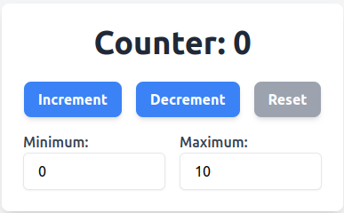

# Vite + React + TailwindCSS



## Description
This project is a basic React application built with Vite and styled with TailwindCSS. It includes a counter that allows you to increment, decrement, and reset values, as well as configure minimum and maximum limits.

## Installation
Follow these steps to run the project:

1. **Clone the repository**:
   ```bash
   git clone <REPOSITORY_URL>
   cd <REPOSITORY_NAME>
   ```

2. **Install dependencies**:
   ```bash
   npm install
   ```

3. **Start the development server**:
   ```bash
   npm run dev
   ```
1. **Clone the repository**:
   ```bash
   git clone git@github.com:Nanakuh/react_counter.git
   cd react_counter
   ```

2. **Install dependencies**:
   ```bash
   npm install
   ```

3. **Start the development server**:
   ```bash
   npm run dev
   ```
   

4. *Open in the browser*:
   Copy and paste the URL provided by the server (default: http://localhost:5173).

## Deployment
The project is deployed at the following link: [Deployed Project](https://your-deployment-link.com)

## Technologies
- *Vite*: For a fast development environment.
- *React*: For building the user interface.
- *TailwindCSS*: For modern and responsive styling.

## Project Structure

├── public
│   └── preview.png       # Project preview image
├── src
│   ├── components
│   │   └── button
│   │       └── Button.tsx
│   ├── App.tsx           # Main component
│   └── main.tsx          # Main entry point
├── tailwind.config.js    # TailwindCSS configuration
└── vite.config.ts        # Vite configuration


## Proposed Improvements
1. Add unit tests using tools like Jest or React Testing Library.
2. Implement internationalization (i18n) to support multiple languages.
3. Add additional validation for configuring minimum and maximum values.
4. Make the application responsive for smaller mobile devices.

---
Thank you for using this project! If you have any suggestions or find issues, feel free to open an issue.
